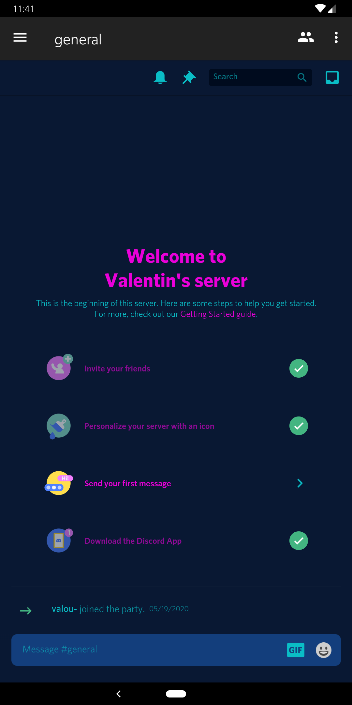

# Discord for android with theming support

Clearly better than the original

## Theming is done with CSS files

You can reuse your BetterDiscord or BeautifulDiscord files, they are the same syntax

## How does it work ?

The app is just a WebView but with support for adding css files

## Great, how do I use it ?

Just open the app, go to settings -> Custom CSS -> Add a CSS file

## What are some projects for the future ?

I need to add a way to change the order of the themes, perhaps javascript support, and fix some things

